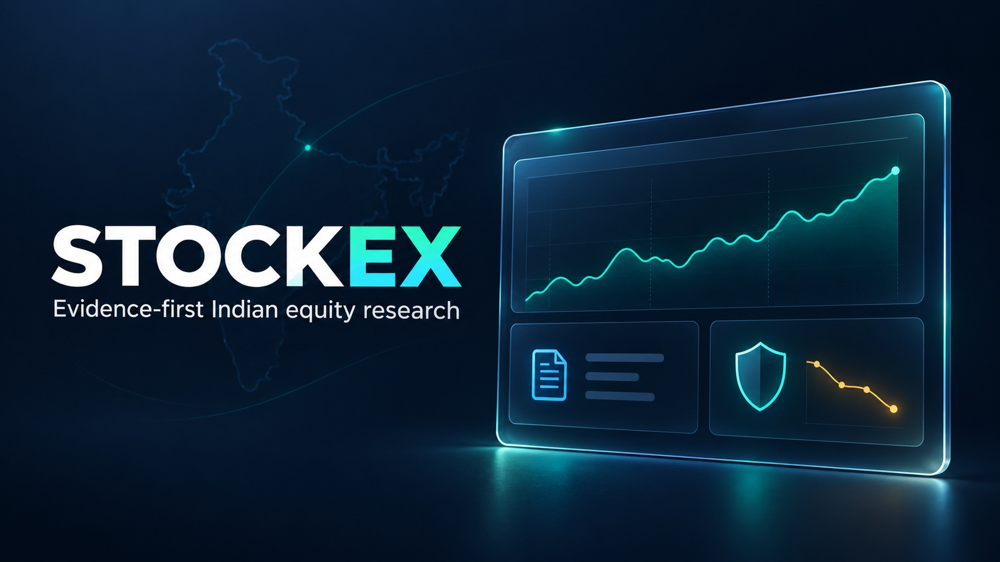
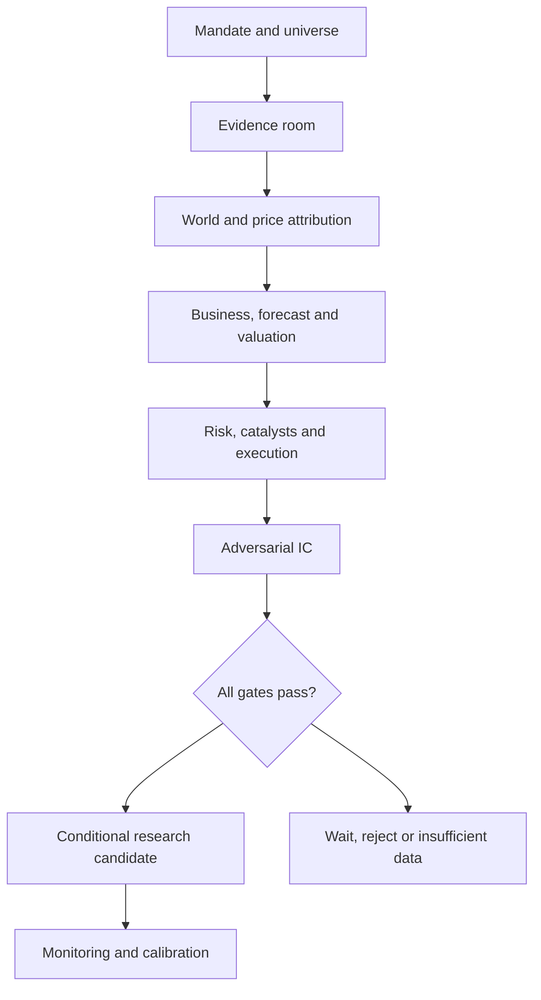

# STOCKEX v3 Institutional Equity Research OS
Created 12 September 2026 and upgraded through 13 September 2026. This is a reusable research system, not a current stock recommendation or an empirically proven trading strategy.

## Start
Open `SKILL.md` in an assistant with web browsing and file access, or upload this complete folder/archive and instruct it to use the workflow. Read `QUICKSTART.md` for request examples. Skills supply instructions; they cannot grant market-data subscriptions or carry themselves automatically into every future conversation.

> [!WARNING]
> This repository is a research and decision-support harness, not investment advice, a broker, a portfolio manager or a guarantee of returns. It is not SEBI-registered and it does not execute trades. Verify every current fact yourself before risking money.

STOCKEX is an evidence-first Indian equity research operating system for conservative, compounding, tactical, event-driven and asymmetric mandates.

The package includes an orchestrator, eleven specialist skills, fifteen gated analyst stages, world-to-stock intelligence, price-move attribution, a point-in-time evidence room, financial normalization, driver forecasting, variant perception, catalyst underwriting, management and relationship analysis, multi-layer risk detection, legal-credit review, portfolio opportunity cost, execution simulation, adversarial IC review, thesis monitoring, calibration, a reusable deep-research prompt and deterministic validators. All wording and code here is original. Linked third-party reports are sources, not redistributed assets or permission to redistribute market data.

## File map
- `assets/stockex-hero.jpg`: repository hero and social cover image.
- `SKILL.md`: workflow entry point.
- `skills/`: screening, evidence room, market intelligence, swing research, fundamentals, variant perception, valuation, risk, skeptical review, investment committee and thesis monitoring.
- `references/`: gated research rules for evidence, world drivers, attribution, normalization, forecasts, expectations, catalysts, management, relationships, risks, legal-credit, portfolio, execution and calibration.
- `prompts/deep-stock-research.md`: portable full-research prompt that delays opinion until the evidence, charts, risk register and adversarial review are complete.
- `templates/`: intake, evidence ledger, financial worksheet, shortlist, recommendation, risk register, market context, portfolio map, prediction record, monitoring, backtest report and decision journal.
- `scripts/finance_helpers.py`: transparent arithmetic, not a stock picker or a data collector.
- `scripts/decision_helpers.py`: return, expectations, acceleration, leakage, portfolio risk, market risk, liquidity, calibration and performance diagnostics.
- `scripts/market_intelligence.py`: benchmark, sector and peer-relative movement plus driver-materiality checks.
- `scripts/forecasting.py`: operating-driver bridges, estimate revisions, scenarios and guidance calibration.
- `scripts/decision_packet.py`: point-in-time, provenance, gate, contradiction, legal-credit, sizing and speculative-control validation.
- `scripts/portfolio_execution.py`: opportunity cost, friction, exit capacity and loss-budget sizing.
- `scripts/calibration.py`: sourced thesis transitions, forecast error and process diagnostics.
- `schema/decision-packet.schema.json`: machine-readable packet contract.
- `references/design-decisions.md`: records which proposed features were included, limited or excluded and why.

## Limits
No connected Indian live feed was tested when this package was created. The new scripts validate supplied data and do not fetch prices, filings or news. Public official pages and documentation were researched. Thresholds, weights, catalyst classifications and regime labels are research hypotheses, not SEBI requirements or backtested alpha. The included helpers evaluate supplied point-in-time records; they do not supply a clean historical dataset. Operational and tax rules must be refreshed when used. Research cannot make an equity suitable for a fixed near-term liability simply because it has the highest score.

## Important warnings and limitations

Read these before using the harness with real money:

- **No guaranteed outcome:** A research candidate can lose part or all of its value. The workflow cannot predict prices, eliminate uncertainty or guarantee a stop, target, exit price or maximum loss.
- **Not financial advice:** Outputs are educational research. Suitability depends on your finances, objectives, taxes, legal position and ability to bear loss. Consult a qualified SEBI-registered investment adviser for personal advice.
- **No live-data promise:** The package has no authenticated Indian live feed. Quotes may be delayed, end-of-day or stale. Refresh price, volume, corporate actions, filings, news, taxes, settlement and trading restrictions immediately before acting.
- **Evidence can be incomplete:** A missing, amended, inaccessible or contradictory annual report, result, announcement, ownership record or price series must produce `INSUFFICIENT DATA` or `WATCH`. Never fill gaps with guesses.
- **Point-in-time matters:** Do not use today's universe, financial data or revised filings to claim a historical backtest. Preserve publication and availability timestamps, adjustments and historical index membership.
- **Risk metrics are not worst-case loss:** Volatility, beta, drawdown, historical VaR and CVaR are backward-looking and window-sensitive. Gaps, overnight news, lower circuits, ASM/GSM restrictions, suspensions and illiquidity can create losses larger than the modelled result.
- **Liquidity is conditional:** Days-to-exit estimates depend on traded value and a participation assumption. They are not execution guarantees. Check spread, depth, free float, price bands, circuit history, trade-to-trade, SME status and surveillance measures.
- **Stops can fail:** A stop-loss may execute at a materially worse price or not execute during a gap or locked circuit. For long-term ownership, use thesis and stress-loss limits rather than assuming a tight technical stop.
- **Formulas are fragile:** DCF, reverse DCF, Graham, Altman, Beneish, Piotroski, CAGR and other formulas are diagnostics with domain and accounting limitations. They are not buy signals, and a formula designed for one sector may be invalid for another.
- **Technical analysis is context:** Charts and indicators describe past price and volume behaviour. Moving averages, support, resistance, ATR, relative strength and momentum do not establish business quality or future direction.
- **News and perception are not proof:** Headlines, social posts, analyst commentary, famous-investor references and fund holdings may be stale, indirect, misidentified or already priced in. Verify legal entities and dated primary disclosures. A holder is not an endorsement.
- **No invented consensus:** If analyst estimates, guidance, ownership or a catalyst cannot be verified, report the gap. Do not convert headline counts or sentiment into a probability.
- **Sizing requires context:** Personalized rupee sizing requires capital, current holdings, approved risk limits, liquidity and loss tolerance. Without them, the harness must show formulas and scenarios only. Do not use its illustrative defaults as personal advice.
- **Backtests can mislead:** Supplied backtests are vulnerable to look-ahead bias, survivorship bias, selection bias, missing delisted stocks, execution slippage, costs, taxes and regime change. A passing backtest is not evidence of future alpha.
- **Research is not order authorization:** Do not provide passwords, API keys or session tokens. The workflow does not authorize a broker connection, order placement, leverage or derivatives trade.
- **Current law wins:** SEBI, NSE, BSE, RBI, tax, settlement, margin and corporate-action rules can change. Check the current official rule and your broker's terms before acting.

If any warning changes the decision, the correct outcome is `WATCH`, `REJECT` or `INSUFFICIENT DATA`, not a forced recommendation.
