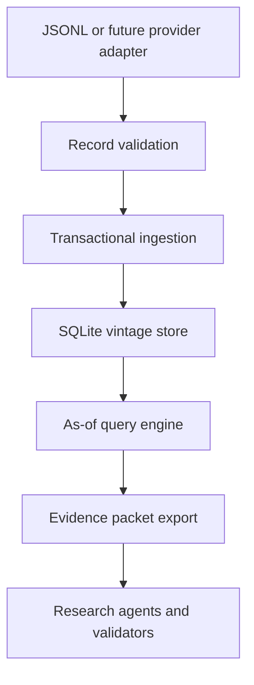

# STOCKEX Point-in-Time Data Foundation Design

## Status

Approved architecture for the first STOCKEX v4 subsystem. This specification covers the local point-in-time evidence store only. Alpha archetypes, live exchange collectors, backtesting, shadow portfolios and automated monitoring remain separate implementation cycles built on this foundation.

## Objective

Build a portable SQLite-backed evidence store that can answer one controlling question reproducibly:

> What information was legitimately available to STOCKEX at decision timestamp `T`?

The store must preserve original and revised observations, stable issuer identities, source provenance, universe eligibility and corporate-action state without silently rewriting history. It must provide deterministic inputs to the existing research, validation and future backtesting layers.

## Success Criteria

The subsystem is complete when it can:

1. initialize a versioned SQLite database with no third-party Python dependency;
2. ingest validated issuers, securities, sources, observations, universe memberships and corporate actions from JSONL;
3. reject malformed timestamps, future-inconsistent records, invalid validity intervals and unsupported revisions;
4. preserve every accepted vintage as an immutable row;
5. return the latest eligible observation whose `available_at <= cutoff` and whose validity interval contains the cutoff;
6. reconstruct a security universe at a historical timestamp without using later membership information;
7. expose provenance and revision metadata with every query result;
8. export a deterministic evidence packet suitable for agents and tests;
9. run entirely offline against supplied data;
10. pass migration, ingestion, revision, cutoff, universe and integrity tests.

## Non-Goals

This cycle will not:

- scrape NSE, BSE or other websites;
- bundle or redistribute licensed market data;
- download annual reports, prices or news;
- calculate alpha scores or issue stock recommendations;
- implement a production web service or multi-user authentication;
- claim that a syntactically valid dataset is complete or investment-grade;
- store secrets, broker credentials or session tokens;
- use an LLM to resolve database constraints.

## Chosen Approach

Use Python's standard-library `sqlite3` module behind a small repository class and a command-line interface. SQLite is the canonical local store. JSONL is the interchange format, not the database. The schema is normalized where identity and history require constraints, while observation payloads use typed value columns plus optional JSON metadata for source-specific details.

This approach is preferred over JSONL-only storage because revision chains, interval queries, unique constraints and transactional imports require database semantics. It is preferred over PostgreSQL-first because the public repository must remain cloneable and usable without credentials or infrastructure. A later storage adapter may implement the same repository interface for PostgreSQL.

## Architecture



The LLM never writes SQL and never decides whether a record is historically eligible. Deterministic Python validates records, executes parameterized statements and emits a bounded evidence packet. Agents interpret only the returned packet.

## Package Boundaries

### `stockex/store/schema.py`

Owns the ordered SQLite migrations and schema version. It exposes:

```python
SCHEMA_VERSION: int
def initialize_database(connection: sqlite3.Connection) -> None
def current_schema_version(connection: sqlite3.Connection) -> int
```

Migrations are idempotent at their declared version and execute inside a transaction.

### `stockex/store/records.py`

Owns record validation, timestamp normalization and canonical serialization. It exposes immutable dataclasses for issuer, security, security-symbol interval, source, observation, universe membership and corporate action records. All timestamps must be timezone-aware ISO 8601 values and are normalized to UTC text for comparison. Original timezone strings may be retained in metadata when supplied.

### `stockex/store/database.py`

Owns parameterized persistence and point-in-time queries. It exposes:

```python
class PointInTimeStore:
    @classmethod
    def open(cls, path: str | pathlib.Path) -> "PointInTimeStore": ...
    def close(self) -> None: ...
    def ingest(self, record: Record) -> IngestResult: ...
    def observation_as_of(self, security_id: str, field: str, cutoff: str) -> dict | None: ...
    def universe_as_of(self, universe_id: str, cutoff: str) -> list[dict]: ...
    def evidence_packet(self, security_id: str, cutoff: str, fields: list[str] | None = None) -> dict: ...
    def integrity_report(self) -> dict: ...
```

### `stockex/store/importer.py`

Owns streaming JSONL imports. It validates every line before mutation, then commits the complete file atomically. One invalid line rolls back that file and reports its line number and error code.

### `stockex/cli.py`

Provides these commands:

```text
stockex init DB_PATH
stockex ingest DB_PATH INPUT.jsonl
stockex as-of DB_PATH SECURITY_ID FIELD --cutoff ISO_TIMESTAMP
stockex universe DB_PATH UNIVERSE_ID --cutoff ISO_TIMESTAMP
stockex packet DB_PATH SECURITY_ID --cutoff ISO_TIMESTAMP [--field FIELD ...]
stockex integrity DB_PATH
```

CLI output is UTF-8 JSON on standard output. Validation and operational errors are structured JSON on standard error with a non-zero exit code.

## Data Model

### Issuers

| Field | Rule |
|---|---|
| `issuer_id` | Stable internal identifier, immutable primary key |
| `legal_name` | Required non-empty string |
| `cin` | Optional Indian corporate identity number |
| `lei` | Optional legal entity identifier |
| `status` | `ACTIVE`, `MERGED`, `DELISTED`, `DISSOLVED` or `UNKNOWN` |
| `metadata_json` | Canonically serialized optional metadata |

### Securities

| Field | Rule |
|---|---|
| `security_id` | Stable internal identifier, immutable primary key |
| `issuer_id` | Required issuer foreign key |
| `isin` | Required and unique when present |
| `exchange` | `NSE` or `BSE` |
| `instrument_type` | Controlled instrument classification |

Ticker history lives in a separate `security_symbols` table with `security_id`, `symbol`, inclusive `valid_from`, exclusive `valid_to` and source provenance. Ticker changes create new interval rows linked to the same stable security identity. Overlapping symbol intervals for one security and exchange are rejected. Research joins use `security_id` or ISIN, never ticker alone.

### Sources

| Field | Rule |
|---|---|
| `source_id` | Stable identifier supplied by the ingestion layer |
| `publisher` | Required |
| `source_class` | Controlled evidence class |
| `uri` | URL or local document reference |
| `published_at` | Time stated by the publisher when known |
| `available_at` | First verified availability time, required for strict historical use |
| `retrieved_at` | Retrieval timestamp |
| `content_hash` | SHA-256 of the supplied source artifact or canonical record |
| `metadata_json` | Filing location, broadcast time, limitations and adapter details |

### Observations

| Field | Rule |
|---|---|
| `observation_id` | Immutable primary key |
| `security_id` | Required foreign key |
| `field` | Namespaced field such as `financial.revenue` or `market.close` |
| `value_type` | `NUMBER`, `TEXT`, `BOOLEAN`, `DATE` or `JSON` |
| `value_number` / `value_text` | Exactly one canonical value representation |
| `unit` | Required for numeric values |
| `period_start` / `period_end` | Economic period covered, when applicable |
| `source_id` | Required provenance foreign key |
| `available_at` | Required historical eligibility timestamp |
| `valid_from` | Inclusive knowledge-validity timestamp, normally equal to `available_at` |
| `valid_to` | Exclusive supersession timestamp or null |
| `revision_of` | Earlier observation ID or null |
| `revision_number` | Zero for original, increasing by one in a chain |
| `quality_status` | `VERIFIED`, `PROVISIONAL`, `ASSUMED_LAG` or `QUARANTINED` |
| `metadata_json` | Basis, units, adjustment version and limitations |

Accepted observations are never updated or deleted through the public API. A correction is inserted as a new observation with `revision_of`; the earlier row remains queryable for cutoffs before the correction became available. Ingestion may close the earlier row's `valid_to` as database-maintained interval metadata, but it cannot alter its value, source, availability or revision identity.

### Universe Memberships

Membership rows contain `universe_id`, `security_id`, inclusive `effective_from`, exclusive `effective_to`, `source_id` and metadata. Overlapping rows for the same universe and security are rejected unless they are byte-identical idempotent re-ingestions.

### Corporate Actions

Corporate-action rows contain `action_id`, `security_id`, type, announcement source, `available_at`, ex-date, record date, effective date, ratio or cash amount, currency and status. The first release stores actions and their provenance but does not calculate adjusted prices. Evidence packets disclose whether price observations are raw or reference a supplied adjustment version.

## Historical Eligibility Rules

For cutoff `T`, an observation is eligible only when:

```text
available_at <= T
AND valid_from <= T
AND (valid_to IS NULL OR T < valid_to)
AND quality_status != QUARANTINED
```

If multiple eligible rows remain, select the greatest `valid_from`, then greatest `revision_number`, then lexicographically smallest `observation_id` as a deterministic tie-breaker. Equal-time conflicting records from different sources are not silently merged. The evidence packet includes the selected record and a `conflicts` array, and the integrity report flags the field for analyst resolution.

Universe membership uses `effective_from <= T` and `(effective_to IS NULL OR T < effective_to)`. A company known later to have failed or delisted remains eligible for earlier universes when its historical membership interval says so.

## Ingestion Contract

Each JSONL line has an envelope:

```json
{
  "record_type": "observation",
  "schema_version": 1,
  "record": {
    "observation_id": "obs_example_revenue_fy26_v0",
    "security_id": "INE000A01001",
    "field": "financial.revenue",
    "value_type": "NUMBER",
    "value_number": 1250.5,
    "unit": "INR_CRORE",
    "period_start": "2025-04-01T00:00:00+05:30",
    "period_end": "2026-03-31T23:59:59+05:30",
    "source_id": "src_exchange_result_20260515",
    "available_at": "2026-05-15T18:04:21+05:30",
    "valid_from": "2026-05-15T18:04:21+05:30",
    "valid_to": null,
    "revision_of": null,
    "revision_number": 0,
    "quality_status": "VERIFIED",
    "metadata": {"basis": "CONSOLIDATED"}
  }
}
```

Validation errors use stable codes, including:

- `RECORD_TYPE_UNSUPPORTED`
- `SCHEMA_VERSION_UNSUPPORTED`
- `TIMESTAMP_NAIVE`
- `INTERVAL_INVALID`
- `SOURCE_MISSING`
- `SECURITY_MISSING`
- `VALUE_REPRESENTATION_INVALID`
- `UNIT_REQUIRED`
- `REVISION_PARENT_MISSING`
- `REVISION_CHAIN_INVALID`
- `MEMBERSHIP_OVERLAP`
- `IDEMPOTENCY_CONFLICT`

Re-ingesting a byte-equivalent canonical record is a no-op. Reusing an existing ID with different canonical content fails the transaction.

## Evidence Packet Contract

The exported packet contains:

```json
{
  "schema_version": 1,
  "security_id": "INE000A01001",
  "cutoff": "2026-06-01T10:00:00Z",
  "generated_at": "2026-09-15T00:00:00Z",
  "observations": [],
  "sources": [],
  "corporate_actions": [],
  "conflicts": [],
  "gaps": [],
  "integrity": {
    "strict_point_in_time": true,
    "quarantined_records_excluded": 0
  }
}
```

`generated_at` records when the export ran and never affects historical eligibility. Sources are deduplicated and sorted by `source_id`; observations are sorted by field and stable ID. Repeating the same query against an unchanged database yields identical analytical content apart from `generated_at`. Tests compare a canonical form that excludes `generated_at`.

## Error Handling and Recovery

- Database creation and imports are transactional.
- SQLite foreign keys are enabled for every connection.
- Write-ahead logging is enabled for safer local reads during ingestion.
- The CLI never overwrites an existing non-SQLite file.
- Import failures report file, line, stable error code and human-readable message without exposing secrets.
- Quarantined records may be retained through a future administrative path but never enter strict as-of queries.
- `integrity` runs foreign-key checks, interval checks, revision-chain checks, conflicting-vintage checks and schema-version checks.
- No automatic network retry exists in this subsystem because it performs no network access.

## Security and Data Rights

The repository ships schema, code and synthetic fixtures only. Runtime databases, downloaded filings and provider exports are ignored by Git. Users are responsible for data-provider terms and redistribution rights. SQL is always parameterized. JSON metadata has size limits and nesting limits to prevent accidental or hostile oversized records.

## Testing Strategy

All behavior is tested with Python's standard `unittest` library and temporary databases.

Required tests cover:

1. database initialization and repeat initialization;
2. foreign-key enforcement;
3. timezone-aware timestamp normalization;
4. rejection of naive and invalid timestamps;
5. atomic JSONL rollback on one invalid line;
6. idempotent replay and conflicting-ID rejection;
7. original observation before revision availability;
8. revised observation after revision availability;
9. exclusion of future and quarantined observations;
10. deterministic conflict surfacing;
11. ticker-history intervals and stable-identifier joins;
12. historical universe inclusion and exclusion;
13. corporate-action provenance in packets;
14. deterministic evidence-packet ordering;
15. integrity-report failures for deliberately corrupted fixtures;
16. CLI success output and structured error output;
17. repository manifest and Markdown-link integrity.

The full existing suite must continue to pass. Tests use synthetic Indian-market-style identifiers and never depend on live exchange endpoints.

## Integration With STOCKEX v3

- `references/point-in-time.md` will link to the executable commands and distinguish timestamp validity from dataset completeness.
- `skills/india-equity-evidence-room/SKILL.md` will require a point-in-time packet when the database is available and retain its documented fallback when it is not.
- `scripts/decision_packet.py` will continue validating final decisions; it will not absorb database responsibilities.
- `manifest.json`, `README.md`, `QUICKSTART.md` and `scripts/USAGE.md` will document the new package and limitations.
- Runtime files such as `*.sqlite`, `*.sqlite3`, `*.db` and generated evidence packets will be excluded from version control, while small synthetic fixtures remain tracked.

## Future Extension Points

Later modules may add provider adapters, PostgreSQL storage, adjusted-price calculations, point-in-time universe builders, alpha archetypes, walk-forward backtests and monitoring. They must consume the public `PointInTimeStore` interface or an equivalent protocol and cannot bypass historical eligibility rules.

## Acceptance Boundary

Passing this subsystem's integrity checks means records are internally consistent and queries respect recorded availability. It does not prove that sources are genuine, the dataset is complete, the recorded availability time is truthful, corporate actions are fully adjusted or a strategy has predictive power. Those claims require separate source certification and validation modules.
